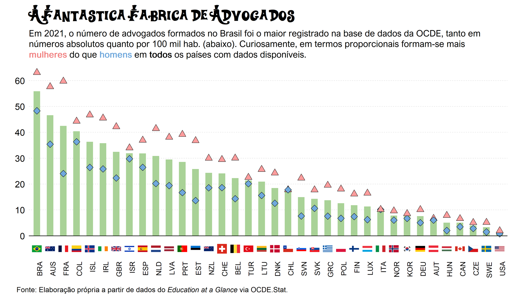

<!-- README.md is generated from README.Rmd. Please edit that file -->

```{r, include = FALSE}
knitr::opts_chunk$set(
  collapse = TRUE,
  comment = "#>"
)
```

#### Introdução

Este repositório contém o código usado para a produção das figuras presentes no texto 'A Fantástica Fábrica de Advogados' (abaixo), publicado no dia 25 de dezembro de 2023. Um arquivo em `.ppt` com as imagens está disponível para download. Foram utilizados principalmente pacotes associados ao `tidyverse`, além de outros pacotes extras, como `extrafont`, `scales` e `countrycode`.

------------------------------------------------------------------------

# A Fantástica Fábrica de Advogados

Durante a cerimônia de credenciamento do IMPA como instituição de ensino superior, no último dia 06/12, o presidente Lula deu uma cutucadinha no alto número de formandos em Direito do país:

> "Me parece que o Brasil é um dos países que mais forma advogados no mundo. Nem China e Índia juntas, que tem 2,6 bilhões de habitantes, formam mais advogados que o Brasil. Nada contra formar advogados. Agora, é preciso que a gente forme mais em Matemática, em Engenharia e em Física."

### A primeira pergunta que vem na mente é: será que realmente formamos muita gente na área do Direito?

Apesar do presidente ter um histórico um pouco polêmico com os números que ele mesmo divulga, nesse caso em específico ele está **certo**. Segundo dados da *Education at a Glance* (OCDE, 2023), **o Brasil formou cerca de 120 mil bacharéis em Direito no ano de 2021** - suficiente para alcançarmos o posto de país que mais lançou profissionais na área dentre todos os 36 com dados disponíveis, tanto em números absolutos quanto em termos per capita (gráfico abaixo, por 100 mil habitantes). E mesmo que duvidássemos do que a OCDE nos mostra, bastaria olhar para as 638 mil pessoas que foram aprovadas no exame unificado da OAB entre 2010 e 2020 (FGV, 2020). Um detalhe interessante de se notar é que todos os países estão formando **mais mulheres do que homens** - seja na métrica absoluta ou relativa - o que talvez adicione uma dimensão de gênero à questão.



Esses números não seriam tão preocupantes se o 'estoque' de advogados em atuação fosse pequeno. Por exemplo, se tivéssemos apenas 50 mil advogados em todo o país, um aumento em 120 mil não seria um problema tão grande, mesmo que em apenas um ano. Poderíamos, em teoria, estar realizando uma trajetória de *catch-up*, ou seja, aumentando o acesso ao ensino superior e, consequentemente, chegando à um número de advogados formados similar ao de países desenvolvidos ou, pelo menos, parecido com dos nossos pares em desenvolvimento. **Acontece que o número de advogados em atuação no Brasil já é muito alto - aproximadamente 1,4 milhão (IBA, 2022) - o que nos torna o país com mais advogados per capita no mundo** (\~700 para cada 100 mil habitantes, acima da Índia, que possui o maior número absoluto). Ou seja, formamos muitos bacharéis sendo que já temos muitos advogados na ativa.

### A segunda pergunta torna-se então: por que isso acontece?

Bom, dois pontos são importantes nessa história toda.

1.  **O primeiro é o alto número de litígios.** Em 2018, o Brasil possuía uma taxa de 10 novos processos cíveis e comerciais para cada 100 habitantes, quase cinco vezes acima da média dos 25 países analisados em estudo da OCDE. A transição estrutural da economia para o setor de serviços sem dúvidas tem uma contribuição bem importante: companhias de TV à cabo, telefone ou de crédito, por exemplo, passaram a reivindicar pequenas quantidades devidas via meio processual, o que naturalmente aumenta a demanda por serviços jurídicos (OCDE, 2020). A falta de clareza das normas também influencia, como acontece com certa frequência em disputas trabalhistas, por exemplo.

2.  **Em segundo lugar, possibilidade de garantir estabilidade e maior retorno.** Inegavelmente, há inúmeras oportunidades para conseguir um emprego público com alto salário quando se possui um diploma de Direito em mãos. Carreiras como as de juiz, promotor e delegado muitas vezes são almejadas pela combinação - perversa - de alta estabilidade e retorno, além do status que proporcionam. Outros cargos, como os fiscais, também são bastante visados, ainda que não sejam exclusivos.

### Por último e não menos importante: tamanho não é documento!

Ou, melhor dizendo nesse caso, **quantidade não é qualidade**. Inclusive, talvez esse seja o ponto principal de toda a história: não formamos bons advogados em sua maioria. Isso porquê, **dos 1.896 cursos disponíveis em 2022, apenas 11% foram avaliados como de boa qualidade, segundo a própria OAB.** Na prática, significa que do universo de formados - e também daqueles que vão se formar - apenas um pedacinho possui 'satisfatório saber jurídico'. No fim das contas, ainda que o Brasil pareça produzir mais advogados do que a fantástica fábrica produz de chocolates, nem todos parecem ser tão bons quanto os doces do Willy Wonka. *Somos apenas uma singela fábrica de advogados, nem tão fantástica assim.*

*Fontes:*

-   [OECD Statistics](https://stats.oecd.org/index.aspx?lang=en#)

-   [OECD Economic Surveys: Brazil (2020)](https://www.oecd-ilibrary.org/economics/oecd-economic-surveys-brazil-2020_250240ad-en)

-   [Lula critica alto número de advogados formados no Brasil e defende investir em cursos 'primordiais para desenvolvimento' - O Globo (06/12/2023)](https://oglobo.globo.com/brasil/educacao/noticia/2023/12/06/lula-critica-alto-numero-de-advogados-formados-no-brasil-e-defende-investir-em-cursos-primordiais-para-desenvolvimento.ghtml)

-   [Brasil tem advogados demais, como afirmou Lula? Entenda - O Estado de São Paulo (08/12/2023)](https://www.estadao.com.br/politica/brasil-pais-numero-advogado-luiz-inacio-lula-da-silva-critica-entenda-nprp/)

-   [Por que Brasil tem maior número de advogados por habitantes do mundo - BBC News Brasil (30/05/2023)](https://www.bbc.com/portuguese/articles/cl52ql8y1jgo#:~:text=Eram%20571%2C3%20profissionais%20da,183%2C9%20milh%C3%B5es%20de%20brasileiros.)
