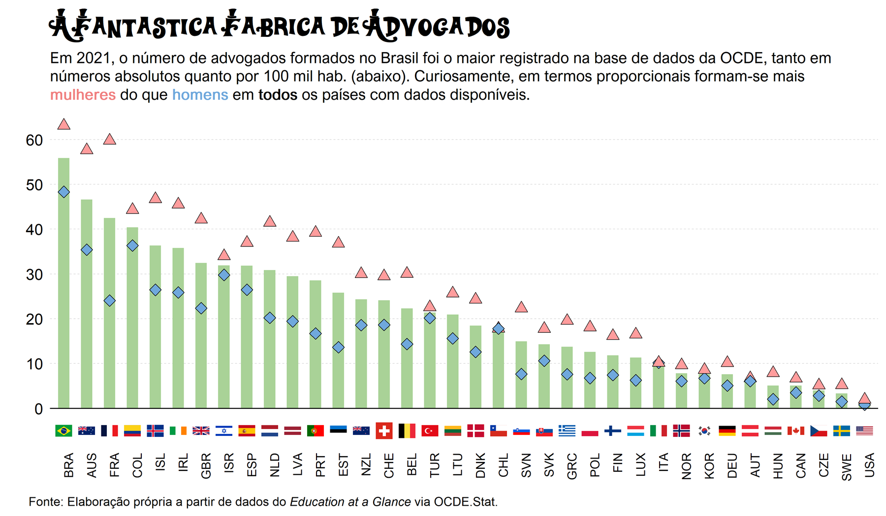

<!-- README.md is generated from README.Rmd. Please edit that file -->

#### Introdução

Este repositório contém o código usado para a produção das figuras
presentes no texto ‘A Fantástica Fábrica de Advogados’ (abaixo),
publicado no dia 25 de dezembro de 2023. Um arquivo em `.ppt` com as
imagens está disponível para download. Foram utilizados principalmente
pacotes associados ao `tidyverse`, além de outros pacotes extras, como
`extrafont`, `scales` e `countrycode`.

------------------------------------------------------------------------

# A Fantástica Fábrica de Advogados

Durante a cerimônia de credenciamento do IMPA como instituição de ensino
superior, no último dia 06/12, o presidente Lula deu uma cutucadinha no
alto número de formandos em Direito do país:

> “Me parece que o Brasil é um dos países que mais forma advogados no
> mundo. Nem China e Índia juntas, que tem 2,6 bilhões de habitantes,
> formam mais advogados que o Brasil. Nada contra formar advogados.
> Agora, é preciso que a gente forme mais em Matemática, em Engenharia e
> em Física.”

### A primeira pergunta que vem na mente é: será que realmente formamos muita gente na área do Direito?

Apesar do presidente ter um histórico um pouco polêmico com os números
que ele mesmo divulga, nesse caso em específico ele está **certo**.
Segundo dados da *Education at a Glance* (OCDE, 2023), **o Brasil formou
cerca de 120 mil bacharéis em Direito no ano de 2021** - suficiente para
alcançarmos o posto de país que mais lançou profissionais na área dentre
todos os 36 com dados disponíveis, tanto em números absolutos quanto em
termos per capita (gráfico abaixo, por 100 mil habitantes). E mesmo que
duvidássemos do que a OCDE nos mostra, bastaria olhar para as 638 mil
pessoas que foram aprovadas no exame unificado da OAB entre 2010 e 2020
(FGV, 2020). Um detalhe interessante de se notar é que todos os países
estão formando **mais mulheres do que homens** - seja na métrica
absoluta ou relativa - o que talvez adicione uma dimensão de gênero à
questão.

Esses números não seriam tão preocupantes se o ‘estoque’ de advogados em
atuação fosse pequeno. Por exemplo, se tivéssemos apenas 50 mil
advogados em todo o país, um aumento em 120 mil não seria um problema
tão grande, mesmo que em apenas um ano. Poderíamos, em teoria, estar
realizando uma trajetória de *catch-up*, ou seja, aumentando o acesso ao
ensino superior e, consequentemente, chegando à um número de advogados
formados similar ao de países desenvolvidos ou, pelo menos, parecido com
dos nossos pares em desenvolvimento. **Acontece que o número de
advogados em atuação no Brasil já é muito alto - aproximadamente 1,4
milhão (IBA, 2022) - o que nos torna o país com mais advogados per
capita no mundo** (~700 para cada 100 mil habitantes, acima da Índia,
que possui o maior número absoluto). Ou seja, formamos muitos bacharéis
sendo que já temos muitos advogados na ativa.

### A segunda pergunta torna-se então: por que isso acontece?

Bom, dois pontos são importantes nessa história toda.

1.  **O primeiro é o alto número de litígios.** Em 2018, o Brasil
    possuía uma taxa de 10 novos processos cíveis e comerciais para cada
    100 habitantes, quase cinco vezes acima da média dos 25 países
    analisados em estudo da OCDE. A transição estrutural da economia
    para o setor de serviços sem dúvidas tem uma contribuição bem
    importante: companhias de TV à cabo, telefone ou de crédito, por
    exemplo, passaram a reivindicar pequenas quantidades devidas via
    meio processual, o que naturalmente aumenta a demanda por serviços
    jurídicos (OCDE, 2020). A falta de clareza das normas também
    influencia, como acontece com certa frequência em disputas
    trabalhistas, por exemplo.

2.  **Em segundo lugar, possibilidade de garantir estabilidade e maior
    retorno.** Inegavelmente, há inúmeras oportunidades para conseguir
    um emprego público com alto salário quando se possui um diploma de
    Direito em mãos. Carreiras como as de juiz, promotor e delegado
    muitas vezes são almejadas pela combinação - perversa - de alta
    estabilidade e retorno, além do status que proporcionam. Outros
    cargos, como os fiscais, também são bastante visados, ainda que não
    sejam exclusivos.

### Por último e não menos importante: tamanho não é documento!

Ou, melhor dizendo nesse caso, **quantidade não é qualidade**.
Inclusive, talvez esse seja o ponto principal de toda a história: não
formamos bons advogados em sua maioria. Isso porquê, **dos 1.896 cursos
disponíveis em 2022, apenas 11% foram avaliados como de boa qualidade,
segundo a própria OAB.** Na prática, significa que do universo de
formados - e também daqueles que vão se formar - apenas um pedacinho
possui ‘satisfatório saber jurídico’. No fim das contas, ainda que o
Brasil pareça produzir mais advogados do que a fantástica fábrica produz
de chocolates, nem todos parecem ser tão bons quanto os doces do Willy
Wonka. *Somos apenas uma singela fábrica de advogados, nem tão
fantástica assim.*

*Fontes:*

- [OECD Statistics](https://stats.oecd.org/index.aspx?lang=en#)

- [OECD Economic Surveys: Brazil
  (2020)](https://www.oecd-ilibrary.org/economics/oecd-economic-surveys-brazil-2020_250240ad-en)

- [Lula critica alto número de advogados formados no Brasil e defende
  investir em cursos ‘primordiais para desenvolvimento’ - O Globo
  (06/12/2023)](https://oglobo.globo.com/brasil/educacao/noticia/2023/12/06/lula-critica-alto-numero-de-advogados-formados-no-brasil-e-defende-investir-em-cursos-primordiais-para-desenvolvimento.ghtml)

- [Brasil tem advogados demais, como afirmou Lula? Entenda - O Estado de
  São Paulo
  (08/12/2023)](https://www.estadao.com.br/politica/brasil-pais-numero-advogado-luiz-inacio-lula-da-silva-critica-entenda-nprp/)

- [Por que Brasil tem maior número de advogados por habitantes do
  mundo - BBC News Brasil
  (30/05/2023)](https://www.bbc.com/portuguese/articles/cl52ql8y1jgo#:~:text=Eram%20571%2C3%20profissionais%20da,183%2C9%20milh%C3%B5es%20de%20brasileiros.)
